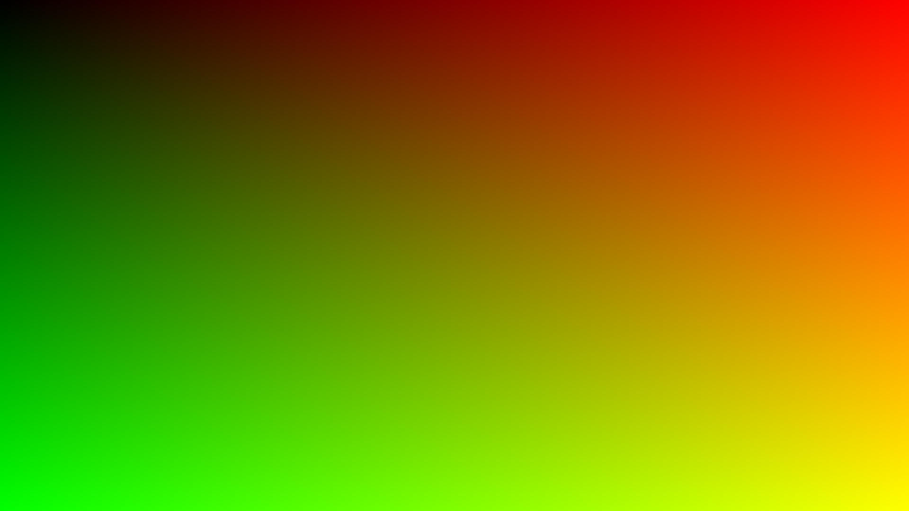

# ShaderVisualHelperGuide

A simple documentation repository containing a collection of notes to assist with shader development and checking vectors and how they should look visually. Often times during shader development, we can forget what certain vectors are supposed to look like visually when we are checking the terms.

### Screen UVs

#### DirectX

This is showing a normalized UV screen coordinate. Normalized meaning it's values between ***(0...1)***. It is comprised of two vectors, x and y. 

In DirectX convention...
- X / R / Horizontal Axis: From Left to Right is 0 to 1
- Y / G / Vertical Axis: From Up to Down is 0 to 1

#### OpenGL

This is showing a normalized UV screen coordinate. Normalized meaning it's values between ***(0...1)***. It is comprised of two vectors, x and y. 

In OpenGL convention...
- X / R / Horizontal Axis: From Left to Right is 0 to 1
- Y / G / Vertical Axis: From Up to Down is 1 to 0

# End

More to come in the future for different common shader terms.