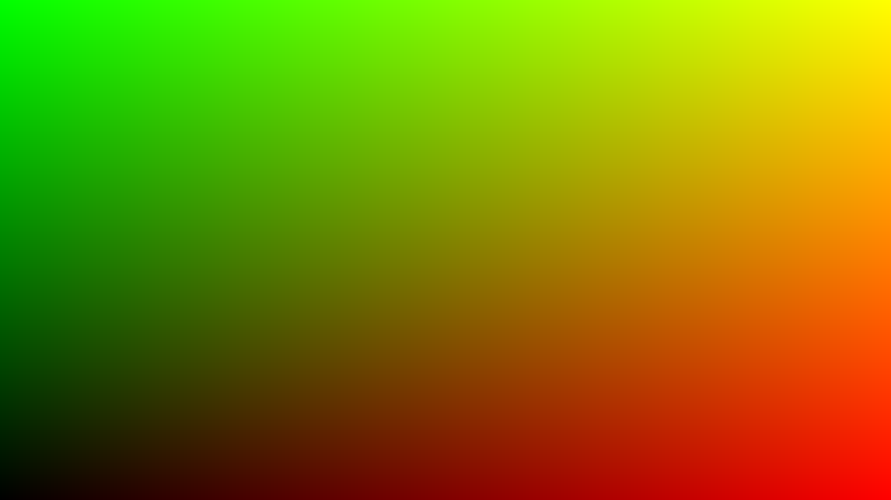
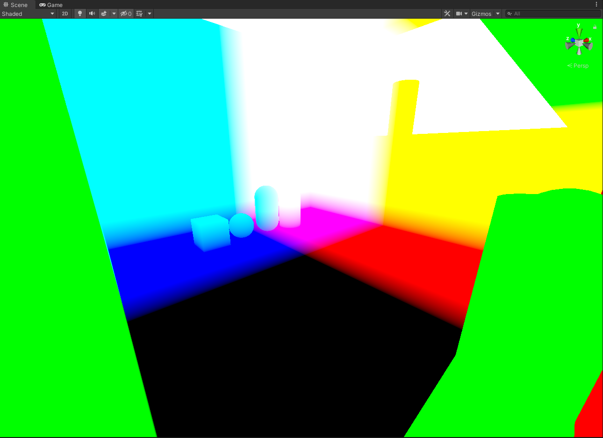
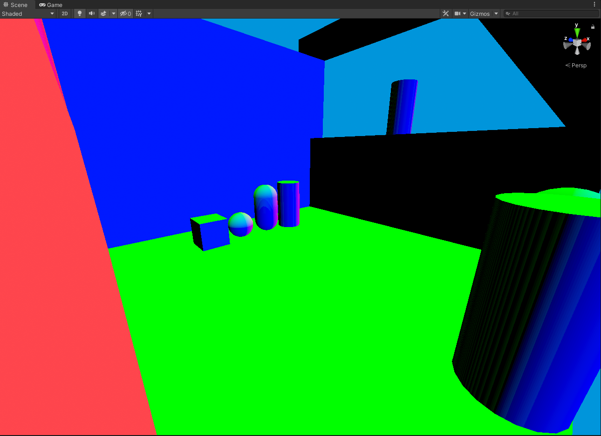
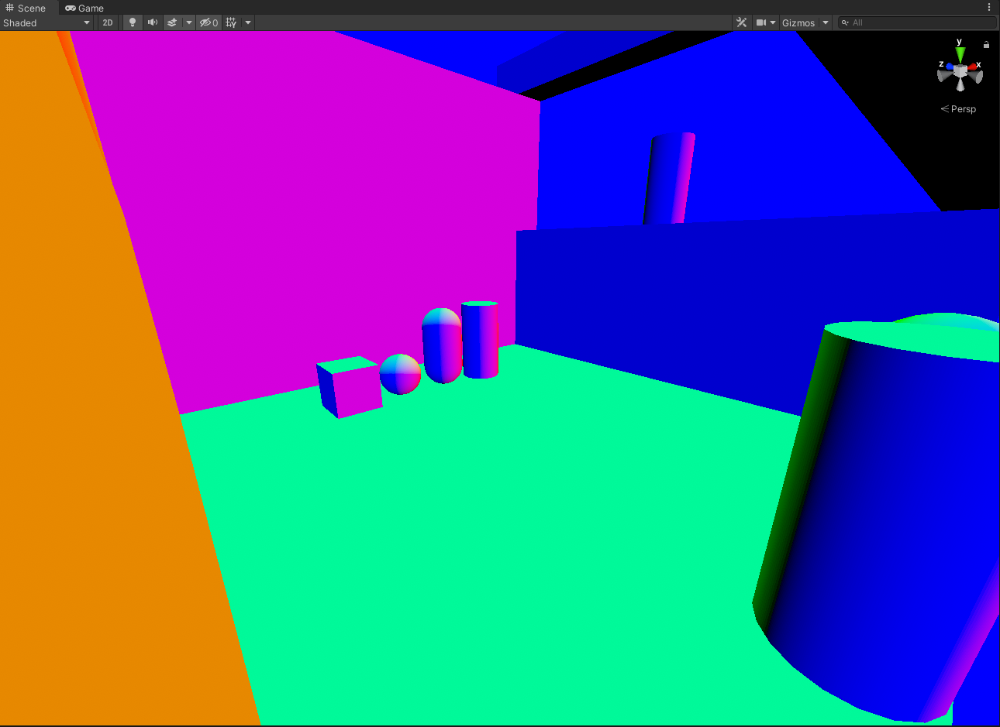

# ShaderVisualHelperGuide

A simple documentation repository containing a collection of notes and screenshots to assist with shader development when checking vectors and how they should look when displayed visually. Often times we can forget what certain vectors are supposed to look like visually when checking terms.

#### Table of Contents

- [Screen UVs](#screen-uvs)
- [World Position](#world-position)
- [World Normals](#world-normals)
- [View Normals](#view-normals)

# Screen UVs

| DirectX                                       | OpenGL                                       |
| --------------------------------------------- | -------------------------------------------- |
|  |  |

This is showing a normalized UV screen coordinate. Normalized meaning it's values between ***(0...1)***. It is comprised of two vectors, x and y. 

In DirectX convention...
- X / R / Horizontal Axis: Left to Right is 0 to 1
- Y / G / Vertical Axis: Up to Down is 0 to 1

In OpenGL convention...
- X / R / Horizontal Axis: Left to Right is 0 to 1
- Y / G / Vertical Axis: Up to Down is 1 to 0

# World Position

#### OpenGL



This is showing a world position vector, comprised of 3 components that are visible ***(x, y z)***. These are not normalized, so values are expected to go beyond (0...1) or (-1...1) depending on the scale of your world.

Looking at world origin (0, 0, 0) should remain black. Moving from there should fall into colors, and the rate at which values change should be linear.

***IMPORTANT NOTE: They should not change value or color when you move/rotate the camera, they should remain in place regardless of where you move the camera.***

# World Normals

#### OpenGL



This is showing a world normal vector, comprised of 3 components that are visible ***(x, y z)***. These are normalized but within (-1...1) range, so some areas may appear black. 

Usually normal vectors when stored in textures or render targets, they are encoded and scaled within (0...1) range by doing...

```HLSL
packedNormal = normal * 0.5f + 0.5f;
```

Which makes them less contrasty and look brighter/smoother. Direction vectors however are expected to be in (-1...1) range so to unpack them...

```HLSL
unpackedNormal = packedNormal * 2.0f + 1.0f;
```

***IMPORTANT NOTE: They should not change value/color/orientation when you move/rotate the camera, they should remain in place regardless of where you move the camera.***

# View Normals

#### OpenGL



This is showing a view normal vector, comprised of 3 components that are visible ***(x, y z)***. These are normalized but within (-1...1) range, so some areas may appear black. 

Usually normal vectors when stored in textures or render targets, they are encoded and scaled within (0...1) range by doing...

```HLSL
packedNormal = normal * 0.5f + 0.5f;
```

Which makes them less contrasty and look brighter/smoother. Direction vectors however are expected to be in (-1...1) range so to unpack them...

```HLSL
unpackedNormal = packedNormal * 2.0f + 1.0f;
```

***IMPORTANT NOTE: They should change value/color/orientation when you rotate the camera. ***

# End

More to come in the future for different common shader terms, any corrections or additions just make a pull request.